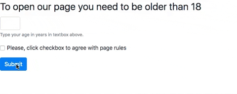
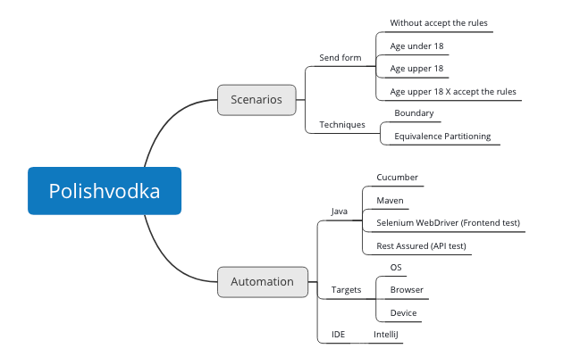

# TDX Challenge 2.0
By João Paulo Miranda - jpmirandas@gmail.com

### Dependencies

In order to run the tests, the following dependencies should be installed in computer under test.
* [Maven](https://maven.apache.org/)
* [Chrome](https://www.google.com/intl/pt-BR/chrome/)
* [Node.js](https://nodejs.org/en/)
* [json-server](https://www.npmjs.com/package/json-server)

 
### Targets
* MacOS Sierra
* Chrome 78

### ChromeDriver
Run the bash script `init.sh` placed into project root directory to download the ChromeDriver.
As said in the previous section, the version `78` is defined as Chrome target.
To change the ChromeDriver version, update the script to get a proper version.
The ChromeDriver versions are available [here](https://chromedriver.chromium.org/downloads).  

### Page under test
A very single static page was created (polishvodka.html).

 

### Test Analysis

A mindmap was created to explore the scenarios to be tested and to help to organize the automation elements. 

### System Properties
The project has a property files, where it is possible to customize some configurations:

`headless.mode:` Enable / disable the Chrome headless mode. Default: true.

`selenium.timeout:` The maximum of time defined to selenium waits for a condition. Default: 5 seconds.

### Setup
Before running tests, the json-server should be launched to simulate a server. Access the project root directory, then run `json-server db.json`.
By default, the json-server uses the port 3000, this port may be changed, if necessary.
See documentation [here](https://www.npmjs.com/package/json-server)

### Run Tests

Enter into project root directory then run:

`mvn clean test -Dmaven.test.failure.ignore=true`

\*When running this command at the first time, all project dependencies will be downloaded.

### Frontend Test Report
After running the tests, an html report can be seen with frontend test results on `target/output/index.html`.
